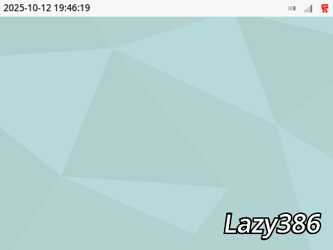

# 🧩 Lazy386 kernel 
 
The Lazy386 kernel is a lightweight monolithic kernel coded in Turbowarp, meant to rival [Micro Consen](https://scratch.mit.edu/discuss/topic/695370/). You can modify this kernel in order to create your own operating system. It is open source, meaning everyone can view and contribute to it. It features:
 - Working [rxFS](https://turbowarp.org/editor?extension=https://extensions.turbowarp.org/0832/rxFS2.js) filesystem
 - Optimized for low-end devices
 - Easy to understand user interface
 - Command-line interface 
# 📜 MIT License

Copyright (c) 2025 Quang Khánh (khanhsers)

Permission is hereby granted, free of charge, to any person obtaining a copy
of this software and associated documentation files (the "Software"), to deal
in the Software without restriction, including without limitation the rights
to use, copy, modify, merge, publish, distribute, sublicense, and/or sell
copies of the Software, and to permit persons to whom the Software is
furnished to do so, subject to the following conditions:

The above copyright notice and this permission notice shall be included in all
copies or substantial portions of the Software.

THE SOFTWARE IS PROVIDED "AS IS", WITHOUT WARRANTY OF ANY KIND, EXPRESS OR
IMPLIED, INCLUDING BUT NOT LIMITED TO THE WARRANTIES OF MERCHANTABILITY,
FITNESS FOR A PARTICULAR PURPOSE AND NONINFRINGEMENT. IN NO EVENT SHALL THE
AUTHORS OR COPYRIGHT HOLDERS BE LIABLE FOR ANY CLAIM, DAMAGES OR OTHER
LIABILITY, WHETHER IN AN ACTION OF CONTRACT, TORT OR OTHERWISE, ARISING FROM,
OUT OF OR IN CONNECTION WITH THE SOFTWARE OR THE USE OR OTHER DEALINGS IN THE
SOFTWARE.
# 💻 System requirements
Here are the required system specs in order for Lazy386 to smoothly run:
 - 2GB RAM or more (4GB reccomended)
 - Chromium, WebKit or Gecko browser engine (Chromium reccomended)
 - Windows, macOS, Linux or any operating system capable of running a Chromium-based or Gecko-based browser
 - 480x360 (4:3) resolution display or higher
 - Mouse and keyboard
# 🔨 Development progress 
Lazy386 is currently in alpha stage, meaning not all features are implemented yet. Roadmap: 
 - ✅ Working GUI 
 - ✅ Status bar 
 - ✅ About 
 - ✅ Dice 
 - ⬜️ Working CLI 
 - ⬜️ Filer 
 - ⬜️ Settings 
 - ✅ Terminal 
 - ⬜️ Music app 
 - ⬜️ Notes app 
 - ⬜️ Translate app 
 - ✅ OOBE (a more complete OOBE will be created after completion of development of other features) 
 You may test the kernel [here](https://turbowarp.org/fullscreen?project_url=raw.githubusercontent.com/khanhsers/Lazy386/main/Lazy386.sb3).
 <!-- sb3 to turbowarp link format: https://turbowarp.org/fullscreen?project_url=raw.githubusercontent.com/(path-to-file) -->
# 📝 Changelog
### v0.5 (ALPHA, 13/10/2025)
 - New command "fortune" (random fun quotes)
 - New command "echo" (prints text, syntax: "~$ echo Hello world!")
 - New command "trim" (trims whitespace, syntax: ~$ trim Hello world!")
 - New command "rev" (reverses text, syntax:~$ rev Hello world!")
 - OOBE bug fixes
 - Small UI changes
### v0.4 (ALPHA, 13/10/2025)
 - Added Terminal
 - New command "time"
 - Bug fixes (a lot)
 - Performance increases and code optimizations  
### v0.3 (ALPHA, 13/10/2025)
 - Added OOBE  
### v0.2 (ALPHA, 12/10/2025)
 - Added window system
 - About & Dice apps finished
 - Added boot menu
 - Added CLI environment
 - Added battery & network icon
 - Created wallpaper  
### v0.1 (ALPHA, 12/10/2025)
 - Added main status bar
 - Added Turbowarp checker
